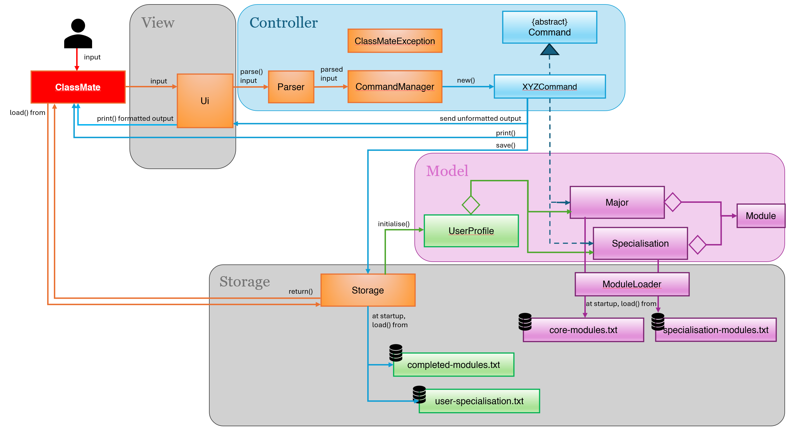

# Wei Na's  Project Portfolio Page

## Overview
ClassMate is a CLI-based course planning assistant for NUS CEG students.

---
### Summary of Contributions
* **Code contribution:** [RepoSense link](https://nus-cs2113-ay2526-s2.github.io/tp-dashboard/?search=lauwn-mower)
    * Developed foundational `Major` and `Module` logic for v1.0
    * Refactored `Display` class into a centralised Ui class for v1.0
    * Refactored of program architecture by decoupling `UserProfile` from File I/O and centralizing the `Storage` component
    * Updated Ui.showHelp() command to consistently keep track of any feature and command updates
    * Enhanced checkProfile feature by improving on the Ui and developing Progress Tracker feature
    * Developed Progress Tracker feature which allows users to view a list of their completed and incomplete modules for both their major and specialisations
    * Added removeSpecialisationCommand as a complement to setSpecialisationCommand
    * Contributed test code to `ModuleTest`, `UiTest`, `CheckProfileCommandTest`, `SetSpecialisationCommandTest`, `RemoveSpecialisationCommandTest`

---
* **User Guide contribution:**
    * Authored v1.0 User Guide layout and core command instructions
    * Updated the v2.1 User Guide
         * Documented UserProfile suite including `checkProfile`, `setSpecialisation`, `removeSpecialisation`
         * Added a Table Of Contents and categorised features instead of listing all features at the onset
         * Updated Command Summary table to include all features as of v2.1

---
* **Developer Guide contribution:**
    * Authored program architecture diagram for v2.1 (see Fig. 1) to follow Model-Controller-View principle
    * Authored initial table of User Stories (see Fig. 2) as of v2.0 (enhanced as of v2.1)
    * Documented `Ui` and `Storage` components to include their responsibilities and design considerations
    * Documented Instructions for Manual Testing on setSpecialisation
    * Documented the design considerations for the Academic Progress Tracker and its implementation using set-theory logic.
 
**Fig. 1: Architecture Diagram as of ClassMate v2.1**

**Fig. 2: Table of User Stories as of v2.0** 
| Priority | As a ...                                  | I want to ...                                 | So that I can ...                                                                 |
| -------- | ----------------------------------------- |-----------------------------------------------|-----------------------------------------------------------------------------------|
| `* * *`  | new user                                  | view usage instructions                       | refer to instructions when I forget how to use the App                            |
| `* * *`  | student                                   | view an overview of graduation requirements   | understand the milestones I need to reach to graduate                             |
| `* * *`  | student                                   | view the prerequisite tree for a module       | identify the sequence of modules required for my target course                    |
| `* * *`  | student                                   | view if a module is offered in a semester     | plan my timetable based on module availability                                    |
| `* * *`  | student looking to specialise             | view modules tied to specific specialisations | explore potential academic tracks and take necessary prerequisites                |
| `* * *`  | student looking to specialise             | view overview of a specialisation             | understand what the specialisation is about to see if it algins with my interests |
| `* *`    | recurring user                            | save my profile and academic history          | avoid the repetitive task of re-entering completed modules                        |
| `* *`    | user who wants a visual overview          | view a progress tracker for my degree         | stay motivated and ensure I am on track for graduation                            |

---

* **Project Management contributions:**    
    * Updated shared GoogleDoc to track weekly tasks and happenings
    * Authored a workflow for teammates to follow [Team-GoogleDoc-Workflow](https://docs.google.com/document/d/1lDx2Q-6_G2kFYOSqNSmqUyn80Z25JdtKvQ5ZFfafY78/edit?tab=t.wf6jpciy2lio)

---
* **Team-based tasks contributions:**
    * Maintaining issue tracker for v1.0, v2.0 and v2.1
    * Released Jar file for v1.0
    * Authored [initial UG structure](https://github.com/AY2526S2-CS2113-W11-4/tp/commit/2ab255e50109bbbf7e927741c8fb5e2d74a67190) and overview of ClassMate application 
    * Authored [initial DG structure](https://github.com/AY2526S2-CS2113-W11-4/tp/commit/c96e31beef1519a73c38f21df4547338e3d87ca0) and user stories
---
* **Review contributions:**
    * Reviewed [PR#93](https://github.com/AY2526S2-CS2113-W11-4/tp/pull/93)
  

